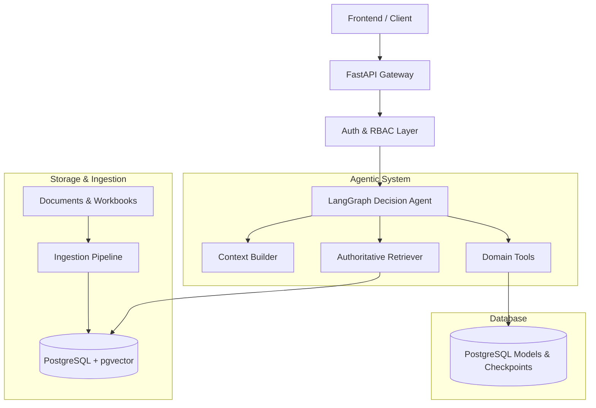

# ParcelPilot Architecture

## System Overview

ParcelPilot is built with a modular, agent-centric architecture designed for real-time logistics support, parcel tracking, ticket management, policy arbitration, and automated yet safe decisions.

## Core Modules

1. **`app/api`**: FastAPI route handlers for auth, chat, decision review, and health checks.
2. **`app/agent`**: LangGraph graph definition, prompt management, context assembly, and response formatting.
3. **`app/tools`**: Executable agent tools for orders, tickets, credits, documents, and escalation.
4. **`app/retrieval`**: Precedence-aware retrieval engine that arbitrates source authority and conflicts according to `source_manifest.yaml`.
5. **`app/ingestion`**: Extractors and chunking pipelines for PDFs and Excel workbooks.
6. **`app/security`**: JWT validation, token lifecycle, and role/permission decorators.
7. **`app/db`**: Async SQLAlchemy models, session management, and repository abstractions.
